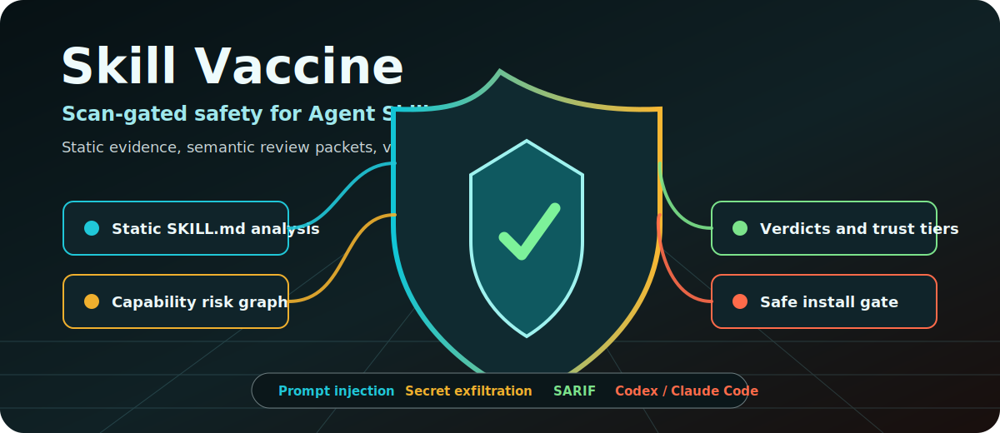

# Skill Vaccine

**Scan-gated safety for Agent Skills before they reach Codex, Claude Code, CI, or a registry.**

<p align="center">
  
</p>

`agent-skills` · `skill-security` · `prompt-injection` · `supply-chain-security` · `sarif` · `codex` · `claude-code`

Skill Vaccine is a local scan gate for Agent Skill packages. It combines one deterministic CLI,
`skill-vaccine`, with one optional Agent Skill adapter, `skills/skill-vaccine-review`, so teams can
block risky packages in CI, review third-party skills with structured evidence, and install only
after a scan-backed verdict.

## Contents

- [Why](#why)
- [What This Is](#what-this-is)
- [Install](#install)
- [npm Package Management](#npm-package-management)
- [Quick Start](#quick-start)
- [Outputs](#outputs)
- [Review Then Install](#review-then-install)
- [Agent-Assisted Review](#agent-assisted-review)
- [Policy Profiles](#policy-profiles)
- [Integrations](#integrations)
- [Documentation](#documentation)
- [Research Basis](#research-basis)
- [Contributing](#contributing)
- [Development](#development)

## Why

Agent skills can hide risk in natural-language instructions, permission claims, helper scripts, and
registry metadata. Skill Vaccine provides a local static review layer with optional
semantic-routing contracts, admission verdicts, trust tier metadata, SARIF output, and benchmark
fixtures.

Current checks cover:

- prompt injection, secret exfiltration, hidden behavior, and governance evasion
- overbroad discovery or selection language in `SKILL.md`
- risky behavior in `SKILL.md`, referenced Markdown docs, and helper scripts across Python, shell,
  PowerShell, batch, and JavaScript fixtures
- missing or mismatched permission/capability declarations
- registry metadata provenance gaps
- cross-file hidden capabilities and cross-skill risk graph links
- semantic review coverage gaps and provider-neutral Layer 2 / Layer 3 contracts

## What This Is

Skill Vaccine is one product with two entry points:

| Entry point | Purpose |
| --- | --- |
| `skill-vaccine` CLI | Deterministic local scans, CI gates, SARIF output, manifests, benchmark checks, and evidence packet generation. |
| `skills/skill-vaccine-review` | Codex/Claude Code adapter that asks the host agent to review a safe packet generated by the CLI. |

The adapter does not replace the CLI. It wraps CLI evidence for semantic review and keeps the
reviewed skill's code unexecuted.

## Install

From npm after the package is published:

```powershell
npm install -g @cchsh/skill-vaccine
skill-vaccine --help
```

From a checkout:

```powershell
python -m pip install -e .
skill-vaccine --help
```

Or run directly from the source tree through the bundled Node wrapper:

```powershell
node bin\skill-vaccine.js scan tests\fixtures\benign_skill
```

For local Codex use, keep one source of truth by linking the installed skill to this checkout:

```powershell
New-Item -ItemType Junction `
  -Path "$env:USERPROFILE\.codex\skills\skill-vaccine-review" `
  -Target ".\skills\skill-vaccine-review"
```

Do not maintain a separate copied skill folder unless you intentionally want it to diverge from the
version that is committed and pushed.

## npm Package Management

The npm package identity is `@cchsh/skill-vaccine`, and it exposes the `skill-vaccine` binary from
`bin/skill-vaccine.js`. The package is configured for public scoped publication with
`publishConfig.access = public`.

Registry status checked on 2026-06-26:

- `npm view @cchsh/skill-vaccine ...` returned `404 Not Found`, so the package name is not published
  on npm yet.
- `npm whoami` returned `E401`, so this workstation is not currently authenticated to npm.
- `npm pack --dry-run` passes and includes the CLI wrapper, Python package, docs, research summaries,
  and `skills/skill-vaccine-review`.

Before publishing:

```powershell
npm login
npm whoami
npm pack --dry-run
npm publish --access public
npm view @cchsh/skill-vaccine name version repository.url homepage --json
```

Until the npm package is published, install from a checkout with `python -m pip install -e .` or run
the bundled wrapper directly with `node bin\skill-vaccine.js ...`.

## Quick Start

Scan a skill:

```powershell
skill-vaccine scan path\to\skill --format text
skill-vaccine scan path\to\skill --format json
skill-vaccine scan path\to\skill --format sarif --fail-on high
```

Scan and install one local Agent Skill package into Codex only if it passes the install gate:

```powershell
skill-vaccine install path\to\skill --format json
skill-vaccine install path\to\skill --skills-dir "$env:USERPROFILE\.codex\skills" --format json
```

Use a JSON or TOML config:

```powershell
skill-vaccine scan path\to\skill --config skill-vaccine.json --format json
skill-vaccine scan path\to\skill --config skill-vaccine.toml --format json
```

Inspect related contracts and reports:

```powershell
skill-vaccine manifest suggest path\to\skill
skill-vaccine semantic schema
skill-vaccine semantic review path\to\skill --provider fake
skill-vaccine jury schema
skill-vaccine jury review path\to\skill --provider fake
skill-vaccine llm schema
skill-vaccine llm prompt path\to\skill --target codex --format markdown
skill-vaccine llm validate llm-response.json
skill-vaccine graph path\to\skills
skill-vaccine eval tests\fixtures\benchmark\labels.json
skill-vaccine telemetry schema
skill-vaccine trust profiles
skill-vaccine trust host-profiles
```

## Outputs

Every scan reports:

- `max_severity`: highest active finding severity
- `verdict`: `approved`, `conditional`, or `rejected`
- `required_trust_tier`: `unvetted`, `local-only`, `reviewed`, or `trusted`
- `inferred_capabilities`: capability IDs derived from findings and declarations
- `findings`: rule IDs, evidence, capability IDs, lifecycle stage, and suppression metadata

JSON and SARIF are intended for CI, registry intake, and review automation. Text output is for local
triage.

## Review Then Install

`skill-vaccine install` is the local install path for installing another Agent Skill. It scans
exactly one local skill package, reads the skill name from `SKILL.md` frontmatter, and copies it into
the Codex skills directory only when the scan is below the install threshold. The default threshold
is `high`, so `high` and `critical` findings block installation.

CLI path:

```powershell
# 1. Inspect the candidate skill without installing it.
skill-vaccine scan path\to\candidate-skill --format text

# 2. Install only if the scan gate passes.
skill-vaccine install path\to\candidate-skill --format json

# 3. Use a stricter local policy when desired.
skill-vaccine install path\to\candidate-skill --fail-on medium
```

Explicit Codex skills directory:

```powershell
skill-vaccine install path\to\candidate-skill `
  --skills-dir "$env:USERPROFILE\.codex\skills" `
  --format json
```

Agent Skill path:

```text
Use $skill-vaccine-review to review path\to\candidate-skill and install it only if it passes.
```

The adapter first asks the CLI to create a safe evidence packet with
`skill-vaccine llm prompt ...`. After semantic review, it uses `skill-vaccine install ...` for the
actual installation. The agent should not copy, link, execute, or run install scripts from the
candidate skill manually.

The install command does not fetch remote repositories, execute reviewed scripts, run package
installers, or overwrite an existing installed skill. A blocked result returns `blocked: true`,
`installed: false`, and keeps the candidate skill out of the Codex skills directory.

## Agent-Assisted Review

Skill Vaccine has two explicit modes.

| Mode | Use it when | What runs | LLM behavior |
| --- | --- | --- | --- |
| CLI-only mode | You need deterministic local scans, install gates, CI gates, SARIF, benchmarks, or registry intake. | `skill-vaccine scan`, `skill-vaccine install`, `semantic review --provider fake`, `jury review --provider fake`. | No LLM call. No network. No reviewed skill code execution. |
| Agent-assisted review | You want Codex or Claude Code to judge intent, permission justification, covert behavior, cross-file consistency, or whether a reviewed skill should be installed. | `skills/skill-vaccine-review` runs `skill-vaccine llm prompt ...`; for installation it runs `skill-vaccine install ...` after review. | The host agent LLM reviews the packet in-session. The CLI still does not call a model API itself. |

Generate a review packet directly:

```powershell
skill-vaccine llm schema
skill-vaccine llm prompt path\to\skill --target codex --format markdown
skill-vaccine llm prompt path\to\skill --target claude-code --format json
skill-vaccine llm validate llm-response.json
```

`skill-vaccine llm schema` prints the JSON contract for both the prompt packet and the expected LLM
response. `skill-vaccine llm prompt` embeds the same `response_schema` in every JSON packet and prints
it in Markdown output so Codex or Claude Code can return machine-checkable review results.
`skill-vaccine llm validate` checks a saved LLM response artifact against that contract and exits
non-zero when required fields, enum values, score ranges, or array fields are invalid.

Use the installable Agent Skill adapter from this repo:

```text
skills/skill-vaccine-review
```

The adapter is intentionally small: it tells Codex or Claude Code to collect local static evidence,
avoid executing reviewed skill code, preserve critical static findings, and return structured JSON
with semantic task results. This is the layered pattern: fast static screening first, semantic review
only when judgment is needed.

## Policy Profiles

Trust tiers describe the minimum operator boundary needed for a skill. Host profiles choose scan
defaults for a specific environment.

Built-in host profiles:

| Profile | Default threshold | Extra checks | Use case |
| --- | --- | --- | --- |
| `local` | `critical` | none | developer workstation triage |
| `ci` | `high` | none | pull request and build gating |
| `registry` | `medium` | semantic routing, metadata audit | registry intake |
| `marketplace-review` | `low` | semantic routing, metadata audit | strict marketplace review |

Explicit CLI flags override config values; config values override host profile defaults.

## Integrations

GitHub Actions:

```yaml
- uses: ./
  with:
    path: .
    fail-on: critical
    sarif-file: skill-vaccine-review.sarif
```

pre-commit:

```yaml
repos:
  - repo: local
    hooks:
      - id: skill-vaccine-review
        name: Skill Vaccine
        entry: skill-vaccine scan .
        language: python
        pass_filenames: false
        args: [--fail-on, high]
```

## Documentation

- [Rules](docs/rules.md)
- [Capabilities](docs/capabilities.md)
- [Config](docs/config.md)
- [Host profiles](docs/host-profiles.md)
- [Trust tiers](docs/trust-tiers.md)
- [Verdicts](docs/verdicts.md)
- [Suppressions](docs/suppressions.md)
- [Registry lifecycle risks](docs/registry-lifecycle-risks.md)
- [Cross-file consistency](docs/cross-file-consistency.md)
- [Risk graph](docs/risk-graph.md)
- [Metadata audit](docs/metadata-audit.md)
- [Semantic Layer 2](docs/semantic-layer2.md)
- [Jury Layer 3](docs/jury-layer3.md)
- [Telemetry schema](docs/telemetry.md)
- [Benchmark](docs/benchmark.md)
- [GitHub Action](docs/github-action.md)
- [pre-commit](docs/pre-commit.md)
- [Release](docs/release.md)
- [Contributing](CONTRIBUTING.md)

## Research Basis

Skill Vaccine is grounded in the local research synthesis at
[research/skill-vaccine-research-synthesis.md](research/skill-vaccine-research-synthesis.md). Korean
paper summaries are indexed in [research/paper_summaries/index.md](research/paper_summaries/index.md).

The implementation maps ideas from SkillSieve, SkillGuard, SkillProbe, Skilldex, OpenSkillEval,
SkillsBench, EvoSkills, SKILL.md semantic-attack work, and broader agent-skill landscape papers into
static rules, semantic-routing contracts, jury protocol scaffolding, evaluation fixtures, and
admission-policy metadata.

## Contributing

See [Contributing](CONTRIBUTING.md) for setup, validation, benchmark update rules, npm release
checks, and safe skill-review contribution rules.

## Development

Run tests:

```powershell
python -m pytest
python -m compileall -q src tests
```

Build distribution artifacts:

```powershell
python -m pip wheel . --no-deps --no-build-isolation -w .codex\review-driven-development\artifacts\wheel-smoke
npm pack --dry-run
```

Current benchmark smoke metrics on the bundled fixture set:

- cases: `14`
- benign controls: `2`
- risky cases: `12`
- precision: `1.0`
- recall: `1.0`
- F1: `1.0`
- F2: `1.0`
- FPR: `0.0`
- suspicious rate: `0.8571`
- escalation rate: `0.7143`
- rule coverage: `1.0`

These are contract-smoke metrics for the MVP fixture suite, not broad scanner-quality claims.


